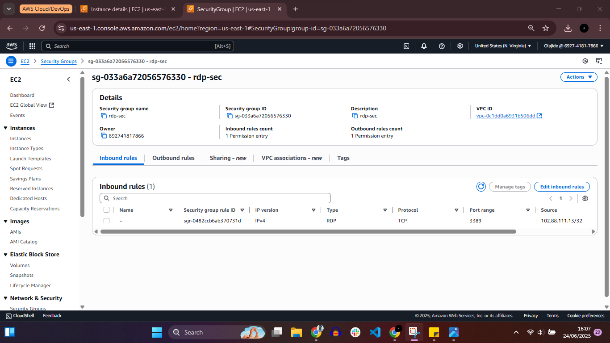
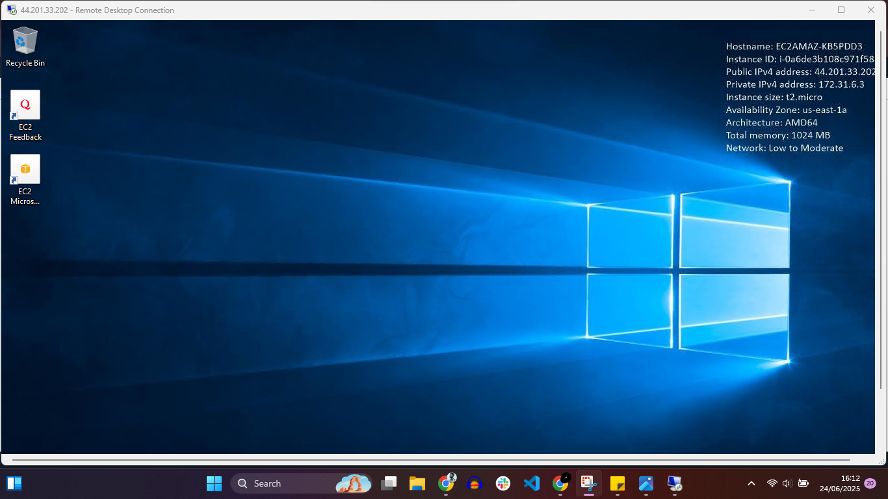

# Windows Server EC2 Deployment with Secure RDP Access

## 📌 Project Overview
This project demonstrates the deployment of a **Windows Server EC2 instance** on AWS with secure remote access configuration. The instance was launched in a public subnet and protected using a tightly restricted security group that allows **RDP access (port 3389) only from my IP address**.

This setup follows AWS security best practices by enforcing least-privilege network access.

---

## 🛠️ Services Used
- Amazon EC2
- Amazon VPC
- AWS Security Groups
- Remote Desktop Protocol (RDP)

---

## 📋 Task Summary
- Launched a Windows Server EC2 instance using the **Amazon Windows Server 2019 Base AMI**
- Deployed the instance in a **public subnet**
- Configured a security group to allow **RDP (TCP 3389) access only from my IP**
- Assigned a **Name tag**: `CSN-Bootcamp-Week3`
- Successfully connected to the instance using **Remote Desktop (RDP)**

---

## ⚙️ Instance Configuration Details
- **AMI:** Amazon Windows Server 2019 Base
- **Instance Type:** (as selected during launch)
- **Subnet:** Public Subnet
- **Public IP:** Enabled
- **Tag Name:** CSN-Bootcamp-Week3

---

## 🔐 Security Configuration
- **Inbound Rule:**
  - Protocol: TCP
  - Port: 3389 (RDP)
  - Source: My IP address only
- **Outbound Rule:** Default (All traffic allowed)

This configuration minimizes exposure and prevents unauthorized remote access.

---

## 📸 Screenshots Evidence

### 1️⃣ Windows EC2 Instance

### 2️⃣ Security Group Inbound Rule (RDP Restricted to My IP)

### 3️⃣ Successful RDP Connection

---

## 🎯 Key Learnings
- Launching and configuring Windows Server EC2 instances
- Securing remote access using IP-restricted security groups
- Understanding public subnet deployments
- Establishing secure RDP connections to AWS resources

---

## 🚀 Use Case
This setup is suitable for:
- Secure administrative access to Windows servers
- Learning Windows-based cloud infrastructure
- Enterprise environments requiring controlled remote access

---
